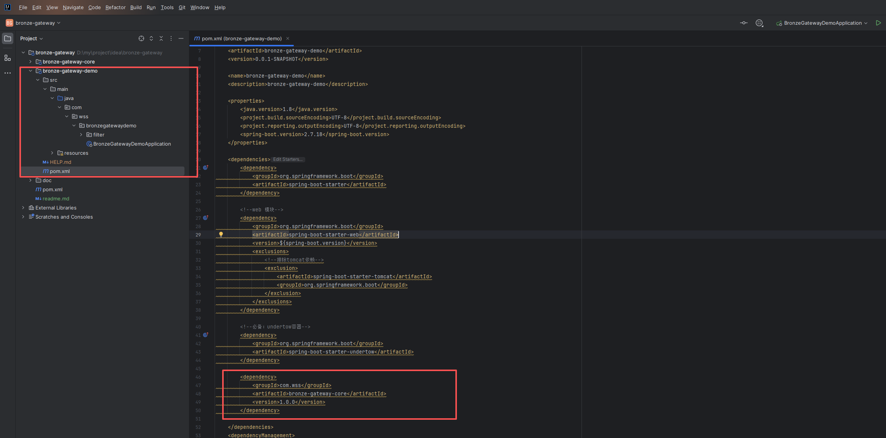
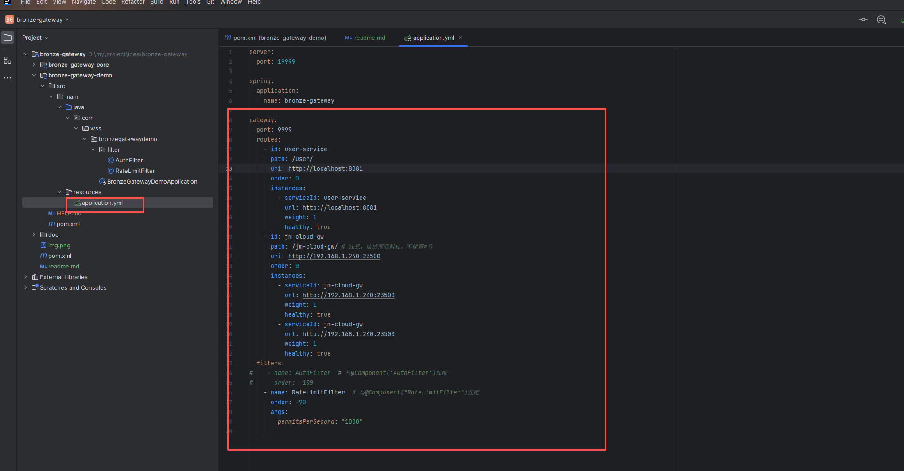
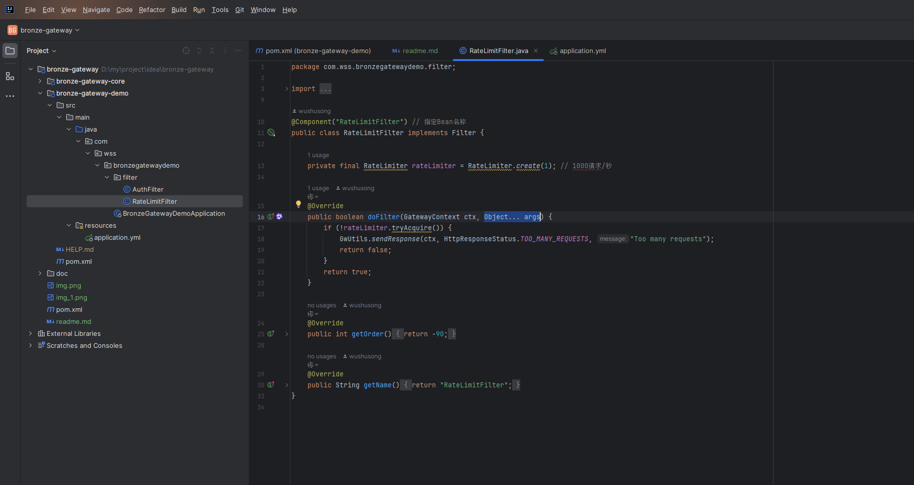
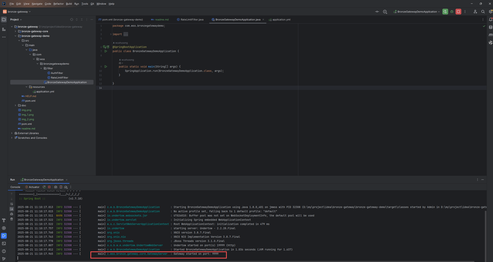
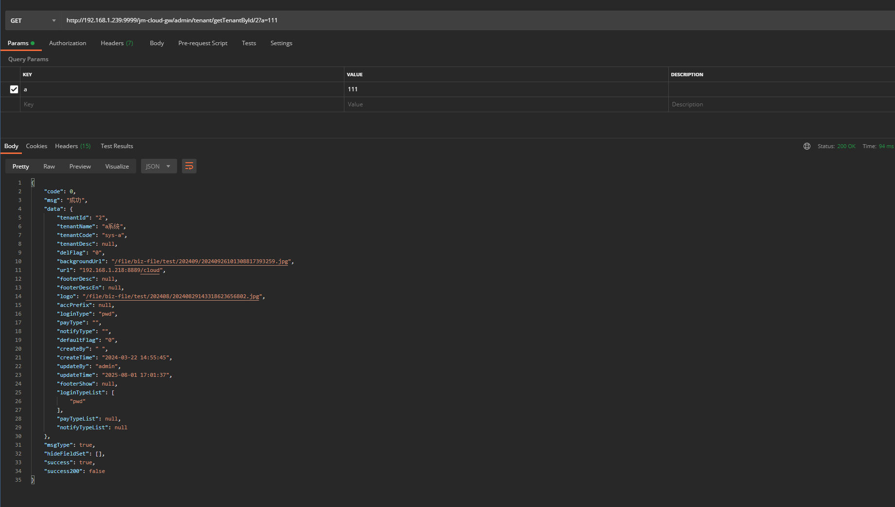
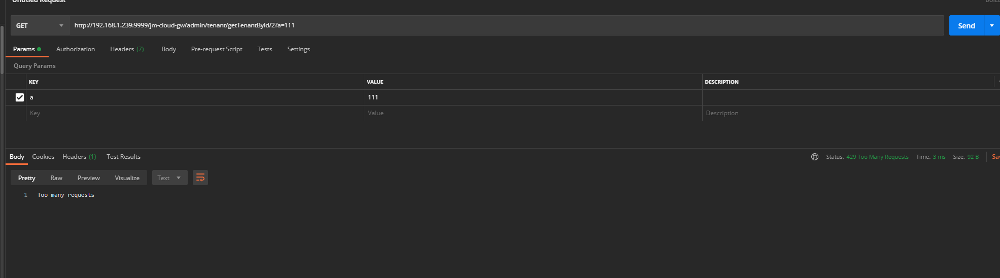
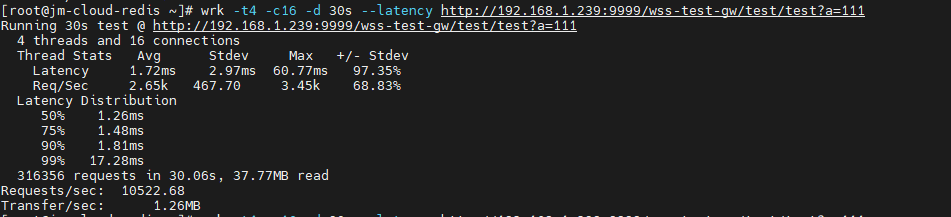

<p align="center">
	
</p>
<h1 align="center" style="margin: 30px 0 30px; font-weight: bold;">bronze-gateway v1.0.4</h1>
<h4 align="center">基于netty实现的轻量级、高性能网关！</h4>
<p align="center">

  
  <a href="https://nas2.wushusong.cn/note/" target="_blank">
    
  </a>
  <a href="#" target="_blank">
    
  </a>
  <a href='https://gitee.com/wushusong/bronze-gateway/stargazers'></img></a>

[](https://gitee.com/wushusong/bronze-gateway)

</p>

# 开源许可

本项目是一个开源项目，使用 Apache-2.0 许可。有关许可的详细信息，请参阅 [LICENSE](LICENSE) 文件。

# 源码

[gitee](https://gitee.com/wushusong/bronze-gateway)

[gitcode](https://gitcode.com/wushusong/bronze-gateway)

# 1、项目集成 bronze-gateway

springboot版本要求：2.7.18及以上

## 1、引入依赖

````
        <dependency>
            <groupId>io.github.wushusong</groupId>
            <artifactId>bronze-gateway-core</artifactId>
            <version>1.0.4</version>
        </dependency>
````

## 2、增加yml配置

````
gateway:
  port: 9999
  backendResponseTimeoutMs: 6000 # 后端响应超时时间
  clientWriteTimeoutMs: 6000 # 客户端写入超时时间
  connectTimeoutMs: 6000 # 连接超时时间
  maxConnectionsPerHost: 64 # 每个主机的最大并发连接数（如果没有配置，使用合理默认值）
  maxPendingAcquires: 10000 # 每个主机最大等待连接数（如果没有配置，使用合理默认值）
  routes:
    - id: user-service # 服务名称，每个服务唯一
      path: /user/ # 服务访问路径，注意，前后都要斜杠，不能有*号
      instances:
        - serviceId: user-service-1 # 服务实例名称，同一个服务下，不同实例，serviceId要求唯一
          url: http://localhost:8081 # 服务地址，到端口一层即可
          weight: 1 # 权重，目前系统默认轮询策略
          healthy: true # 服务健康状态，预留，目前默认为true
    - id: jm-cloud-gw
      path: /jm-cloud-gw/ # 注意，前后都要斜杠，不能有*号
      loadBalancerType: weightedLoadBalancer # 负载均衡类型 roundRobinLoadBalancer轮询 / WeightedLoadBalancer权重
      instances:
        - serviceId: jm-cloud-gw-1
          url: http://192.168.1.240:23500
          weight: 1
          healthy: true
        - serviceId: jm-cloud-gw-2
          url: http://192.168.1.111:23500
          weight: 1
          healthy: true
#  filters:
#    - name: AuthFilter  # 与@Component("AuthFilter")匹配
#      order: -100
#    - name: RateLimitFilter  # 与@Component("RateLimitFilter")匹配
#      order: -90
#      args:
#        permitsPerSecond: "1000"

#熔断配置
  resilience:
    failureRateThreshold: 50 # 失败率阈值百分比
    slowCallRateThreshold: 50 # 慢调用率阈值百分比
    slowCallDurationThreshold: 10 # 慢调用持续时间阈值
    waitDurationInOpenState: 60 # 熔断器开启状态持续时间
    permittedNumberOfCallsInHalfOpenState: 5 # 半开状态允许的调用次数
    minimumNumberOfCalls: 2 # 计算失败率所需的最小调用次数
    slidingWindowSize: 5 # 滑动窗口大小

````

# 熔断

如果需要使用熔断，需要再启动类上增加注解：[WssResilienceEnable.java](bronze-gateway-core%2Fsrc%2Fmain%2Fjava%2Fcom%2Fwss%2Fbronze%2Fgateway%2Fcore%2Fannotation%2FWssResilienceEnable.java)

# 测试





自定义限流，继承接口Filter



启动



测试

请求地址：http://192.168.1.239:9999/jm-cloud-gw/admin/tenant/getTenantById/2?a=111

会根据yml配置。匹配：jm-cloud-gw 代理到实例：jm-cloud-gw，并代理到地址 http://192.168.1.240:23500，完整代理后地址： http://192.168.1.240:23500/admin/tenant/getTenantById/2?a=111



限流





# 有问题请issues或者添加本人qq：1193302291
